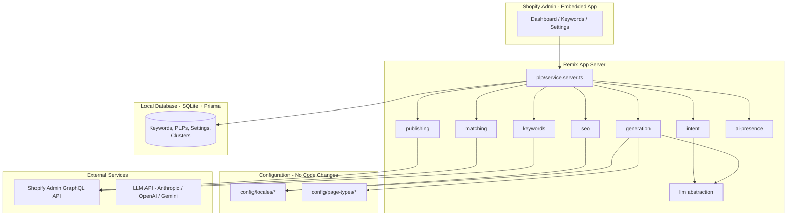
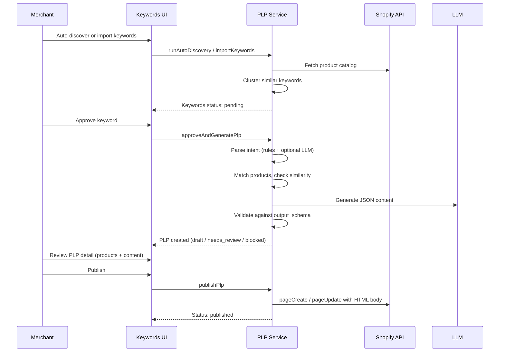

# How the PLP SEO Generator App Works

This document explains how the app operates end-to-end: what happens when a merchant installs it, how data flows through each stage, and how the main modules fit together.

---

## 1. What the app does

The app is an embedded **Shopify admin app** that:

1. Ingests search keywords (from the store catalog or merchant input).
2. Parses each keyword into structured shopping **intent** (style, room, color, audience, etc.).
3. Matches products from the Shopify catalog to that intent.
4. Generates unique, locale-aware page content using an LLM.
5. Validates content against a strict JSON schema before anything is published.
6. Publishes SEO-ready **Product Listing Pages (PLPs)** as Shopify Online Store pages.
7. Maintains **AI crawler files** (`llms.txt`, `sitemap-ai.xml`) for discoverability.

The merchant controls the pipeline through the admin UI: approve keywords, review low-match pages, and publish when ready.

---

## 2. High-level architecture



**Stack:** Remix (Shopify app template), Polaris UI, Prisma + SQLite, Shopify session OAuth, Admin GraphQL API.

---

## 3. Authentication and Shopify integration

On install, the app uses standard **Shopify OAuth** via `@shopify/shopify-app-remix`:

- Sessions are stored in Prisma (`Session` model).
- Every admin route calls `authenticate.admin(request)` before running loaders or actions.
- API calls use the shop’s offline access token through the embedded admin GraphQL client.

**Required scopes** (`shopify.app.toml`):

- `read_products` / `write_products` — catalog fetch and product context.
- `read_content` / `write_content` — create and update Online Store pages.

Webhooks handle `app/uninstalled` and `app/scopes_update` (template defaults).

---

## 4. Data model

The app stores business data in SQLite via Prisma (in addition to Shopify sessions).

| Model | Purpose |
|-------|---------|
| `ShopSettings` | Per-shop: LLM preference, default locales, brand tone, min product count (default 6), similarity threshold (default 0.85). |
| `Keyword` | Raw keyword, source (`auto` / `csv` / `manual`), locale, parsed intent JSON, status (`pending` / `approved` / `rejected`), cluster id. |
| `KeywordCluster` | Groups semantically similar keywords; one canonical keyword per cluster. |
| `PlpPage` | Generated page: slug, locale, matched product IDs, AI content JSON, SEO meta, status, Shopify page id/url, similarity score. |

**PLP statuses:**

| Status | Meaning |
|--------|---------|
| `draft` | Generated, enough products, not yet published. |
| `needs_review` | Fewer than minimum products (default 6); cannot publish. |
| `blocked` | Intent too similar to an existing published PLP; cannot publish. |
| `published` | Live on Shopify as an Online Store page. |

---

## 5. End-to-end merchant workflow



### Step 1 — Keyword ingestion

**Auto-discovery (default)**  
`app/lib/keywords/discovery.ts` scans the catalog (titles, tags, collections, descriptions) and builds n-gram phrases (2–4 words). Phrases that look like wallpaper queries are scored by frequency. Top opportunities are saved as `Keyword` records with `source: auto`.

**CSV / manual paste**  
`app/lib/keywords/import.ts` parses one keyword per line (CSV) or newline/comma-separated paste. Duplicates are removed.

**Clustering (cannibalization prevention #1)**  
Before generation, `app/lib/keywords/clustering.ts` groups keywords with high **Jaccard similarity** on tokens (default cluster threshold 0.72). Only the **canonical** keyword per cluster is stored for generation, reducing duplicate PLPs for near-identical queries.

### Step 2 — Intent parsing

**Input example:** `sustainable midnight blue wallpaper kids room`

**Output example (structured):**

```json
{
  "raw": "sustainable midnight blue wallpaper kids room",
  "color": "midnight blue",
  "attribute": "sustainable",
  "use_case": "kids room",
  "room": "kids room",
  "audience": "parents",
  "tokens": ["sustainable", "midnight", "blue", "wallpaper", "kids", "room"]
}
```

**How it works** (`app/lib/intent/`):

1. **Rules engine** (`rules.ts`) — regex/pattern matching for colors, styles, rooms, attributes, audience. Fast and deterministic.
2. **LLM fallback** (`parser.ts`) — if rules leave too many gaps (long or vague query), a small JSON extraction prompt runs via the LLM abstraction.
3. **Locale terms** — room/style labels can be mapped to market terminology from `config/locales/{market}/market.json`.

### Step 3 — Product matching

`app/lib/matching/matcher.ts` scores every catalog product against the parsed intent:

| Signal | Weight (approx.) |
|--------|------------------|
| Room / use case in title, tags, description | High |
| Style, attribute | Medium |
| Color | Medium |
| Token overlap | Low |

**Negative rules:** For intents like `kids room`, products whose text contains `dark`, `moody`, `gothic`, etc. are penalized so inappropriate items do not surface.

**Threshold:** If fewer than `ShopSettings.minProductCount` products score above zero (default **6**), the PLP status is set to **`needs_review`** and publishing is blocked.

Merchants can override matches via `manualProductIds` on the PLP (stored in DB; wired for future UI).

### Step 4 — Cannibalization check (pre-generation)

`app/lib/seo/cannibalization.ts` compares the new intent to all **published** PLPs:

- **Field overlap** (style, room, color, attribute, etc.) — 60% of score.
- **Keyword token Jaccard** — 40% of score.

If combined similarity ≥ `similarityThreshold` (default **0.85**), status is **`blocked`**.

### Step 5 — AI content generation

**Page type config** (`config/page-types/*.json`) defines:

- `generation.system_prompt` — role and constraints for the model.
- `generation.user_prompt_template` — placeholders for keyword, intent, products, locale, related PLPs.
- `output_schema` — JSON Schema enforced by **Ajv** (`app/lib/generation/validator.ts`).

**Pipeline** (`app/lib/generation/pipeline.ts`):

1. Load page type + locale config.
2. Fill prompt template with real intent and matched product subset (up to 12 products).
3. Call LLM with `jsonMode` (provider-specific).
4. Parse response as JSON; validate against `output_schema`.
5. Retry up to **3 times** with validation errors fed back to the model.
6. On persistent failure, throw — **invalid JSON is never saved for publish**.

**Required content shape** (example from `style-room` page type):

- `h1` — must align with target keyword.
- `intro` — topic clear in first 100 words (for AI citation).
- `sections` — min 3, H2/H3 expand topics without repeating H1.
- `faq` — min 4, standalone answers.
- `schema_markup` — base structured data from model.
- `meta_title` / `meta_description` — CTR-focused, separate from body.
- `product_alt_texts` — per product id, intent-aware (not just product title).
- `internal_links` — related PLP slugs/anchors.

**Internal links** (`app/lib/seo/internal-links.ts`) are computed from **shared intent attributes** among published PLPs in the same locale (e.g. same style, different room) and injected into the prompt and final HTML.

### Step 6 — Publishing to Shopify

**Mechanism:** Shopify **Online Store Pages API** (`app/lib/publishing/pages.server.ts`).

**Why Pages API:** Works on any store without theme rewrites; full HTML body can include JSON-LD, hreflang, and noindex. Tradeoff: less structured than Metaobjects, but fastest path for plug-and-play install.

**Rendered HTML** (`app/lib/seo/render-page.ts`) includes:

- `<title>` and meta description.
- Self-referencing **canonical** URL.
- **hreflang** alternates for all configured locales.
- **`noindex`** on draft / needs_review / blocked (Shopify indexes published pages quickly).
- Full **JSON-LD stack** from `app/lib/seo/jsonld.ts`:
  - `CollectionPage`
  - `ItemList` with `ListItem` per product (enables product carousels in Google).
  - `FAQPage`
  - `BreadcrumbList`
- Product grid with intent-based **alt text**.
- FAQ block and related PLP links.

**URL pattern:** `{shop}{locale.urlPrefix}{PLP_URL_PREFIX}/{slug}` (e.g. `/en-us/pages/plp/botanical-wallpaper-living-room`).

### Step 7 — AI presence files

When PLPs are published, the app can rebuild:

| File | Route | Purpose |
|------|-------|---------|
| `llms.txt` | `/llms.txt?shop={shop}` | Plain-language index of published PLPs, intents, slugs (emerging AI crawler standard). |
| `sitemap-ai.xml` | `/sitemap-ai.xml?shop={shop}` | XML sitemap with AI metadata: keyword, intent summary, product count, locale. |

Generators: `app/lib/ai-presence/llms-txt.ts`, `sitemap-ai.ts`.  
Preview in admin: **AI presence** page.

**Storefront setup:** Map `https://{shop}/llms.txt` to the app URL via App Proxy or theme redirect (see README).

---

## 6. Multi-locale system

Locale is **not** an afterthought. Each market is a folder:

```
config/locales/
  en-us/market.json
  en-au/market.json
  fr-fr/market.json
  fr-be/market.json   # Belgium French
  nl-be/market.json   # Belgium Dutch
  de-de/market.json
  ...
```

Each `market.json` defines:

| Field | Used for |
|-------|----------|
| `language` / `region` | Prompt language and cultural context |
| `currency` / `currencySymbol` | Pricing in copy and JSON-LD |
| `measurementSystem` | imperial vs metric in prompts and guides |
| `urlPrefix` | e.g. `/fr-be` in canonical URLs |
| `hreflang` | e.g. `fr-BE` in link tags |
| `terminology` | Market terms (e.g. lounge vs living room) |
| `promptContext` | Injected into LLM user prompt |

**Adding a market:** Add `config/locales/{id}/market.json` and register it in `config/locales/index.ts`. No application code changes.

US English and Australian English are **separate pages** (different slugs, terms, measurements, currency) — not simple translation.

---

## 7. LLM provider abstraction

`app/lib/llm/` implements a single interface:

```ts
complete(messages, options?) => Promise<string>
```

**Switch provider via `.env` only:**

```env
LLM_PROVIDER=anthropic   # or openai | gemini
LLM_MODEL=claude-sonnet-4-20250514
ANTHROPIC_API_KEY=...
```

Implementations:

- `providers/anthropic.ts` — Messages API.
- `providers/openai.ts` — Chat Completions + `response_format: json_object`.
- `providers/gemini.ts` — `generateContent` + `responseMimeType: application/json`.

`completeJson()` strips markdown fences and is used by intent parsing and PLP generation.

---

## 8. Page type configuration

Page types live in `config/page-types/`:

| File | Use case |
|------|----------|
| `style-room.json` | Style × room intent (e.g. botanical wallpaper living room) |
| `use-case.json` | Attribute / audience / use case (e.g. sustainable kids room) |

Each file controls the **entire generation pipeline** for that page shape:

```json
{
  "id": "style-room",
  "seo": { "title_template": "...", "description_template": "..." },
  "generation": {
    "temperature": 0.5,
    "system_prompt": "...",
    "user_prompt_template": "..."
  },
  "output_schema": { "type": "object", "required": ["h1", "intro", ...] }
}
```

Add a new page type by adding a JSON file and registering it in `config/page-types/index.ts`.

---

## 9. Admin UI routes

| Route | Function |
|-------|----------|
| `/app` | Dashboard — all PLPs, status badges, publish action |
| `/app/keywords` | Discover, import, view parsed intent, approve/reject, trigger generation |
| `/app/plp/:id` | Product match preview, intent JSON, generated content, publish |
| `/app/settings` | Brand tone, min products, similarity threshold, default locales |
| `/app/ai-presence` | Preview `llms.txt` and `sitemap-ai.xml` |

Navigation is defined in `app/routes/app.tsx` (embedded App Bridge + Polaris).

---

## 10. Orchestration layer

`app/lib/plp/service.server.ts` is the main coordinator:

| Function | Action |
|----------|--------|
| `getOrCreateShopSettings` | Ensure per-shop defaults exist |
| `runAutoDiscovery` | Catalog → keywords + clusters |
| `importKeywords` | CSV/paste → keywords + clusters |
| `approveAndGeneratePlp` | Full pipeline: intent → match → generate → save PLP |
| `publishPlp` | Render HTML → Shopify page → update status |
| `buildAiPresenceFiles` | Regenerate llms.txt and sitemap-ai.xml from published PLPs |

---

## 11. SEO safeguards summary

| Risk | Mitigation |
|------|------------|
| Thin / low-match PLPs | Minimum product count; `needs_review` status |
| Duplicate keywords | Pre-generation clustering |
| Competing PLPs | Similarity check → `blocked` |
| Locale duplicates | hreflang + optional `canonicalLocaleId` |
| Draft indexation | `noindex` in HTML until published |
| Weak structured data | Full JSON-LD stack on every published page |
| Orphan PLPs | Internal links computed at generation time |
| AI discoverability | Auto-updated `llms.txt` and `sitemap-ai.xml` |

---

## 12. Environment variables

See `.env.example`. Key variables:

| Variable | Role |
|----------|------|
| `SHOPIFY_API_KEY` / `SHOPIFY_API_SECRET` | App credentials |
| `SCOPES` | OAuth scopes |
| `LLM_PROVIDER` / `LLM_MODEL` | AI backend selection |
| `ANTHROPIC_API_KEY` / `OPENAI_API_KEY` / `GEMINI_API_KEY` | Provider keys |
| `MIN_PRODUCT_COUNT` | Default 6 |
| `SIMILARITY_THRESHOLD` | Default 0.85 |
| `PLP_URL_PREFIX` | Default `/pages/plp` |

---

## 13. Project layout reference

```
shopify-ceo-plp-app/
├── app/
│   ├── lib/                    # Core business logic
│   │   ├── plp/service.server.ts
│   │   ├── keywords/
│   │   ├── intent/
│   │   ├── matching/
│   │   ├── generation/
│   │   ├── llm/
│   │   ├── seo/
│   │   ├── publishing/
│   │   ├── ai-presence/
│   │   └── catalog/
│   ├── routes/                 # Remix routes (UI + public files)
│   └── shopify.server.ts
├── config/
│   ├── locales/                # Per-market JSON
│   └── page-types/             # Generation configs + schemas
├── prisma/schema.prisma
├── docs/HOW_THE_APP_WORKS.md   # This file
└── README.md                   # Setup and quick reference
```

---

## 14. Running locally

```bash
cp .env.example .env
# Fill Shopify + LLM keys

npm install
npx prisma migrate dev
npm run dev   # or: shopify app dev
```

Install on a **Shopify development store** through the CLI dev flow. The app does not require access to a production Wild Palace store.

---

## 15. Extending the app

| Goal | Where to change |
|------|-----------------|
| New country/market | `config/locales/{id}/market.json` + `index.ts` |
| New PLP template | `config/page-types/{id}.json` + `index.ts` |
| Stricter matching | `app/lib/matching/matcher.ts` weights and negatives |
| Different publish target | Replace `app/lib/publishing/pages.server.ts` (e.g. Metaobjects) |
| New LLM provider | Add `app/lib/llm/providers/{name}.ts` + case in `llm/index.ts` |
| Storefront llms.txt at root | Shopify App Proxy → `/llms.txt` route |

For setup steps and evaluation-oriented tradeoffs, see the root [README.md](../README.md).
